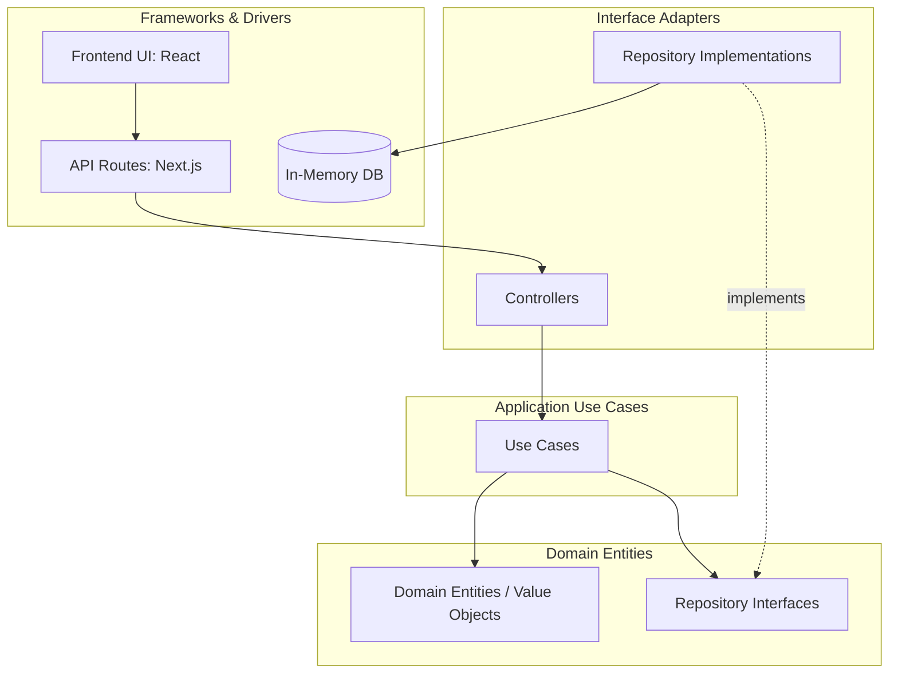
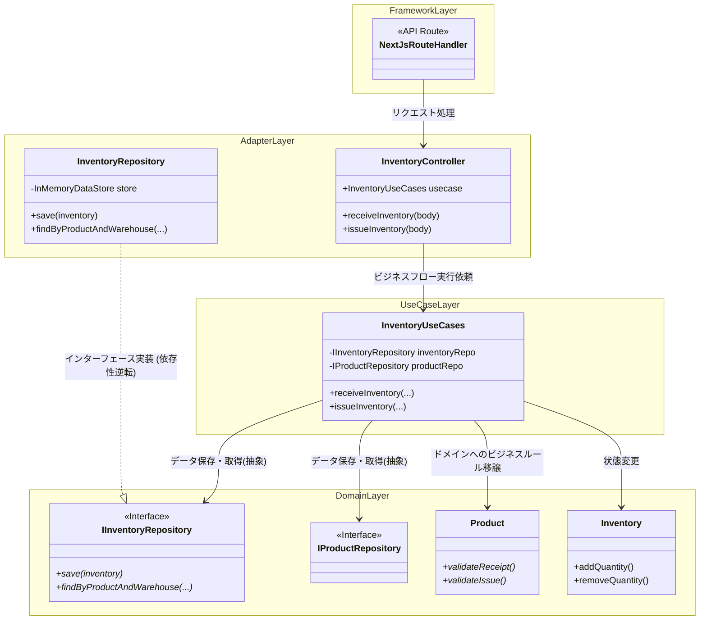
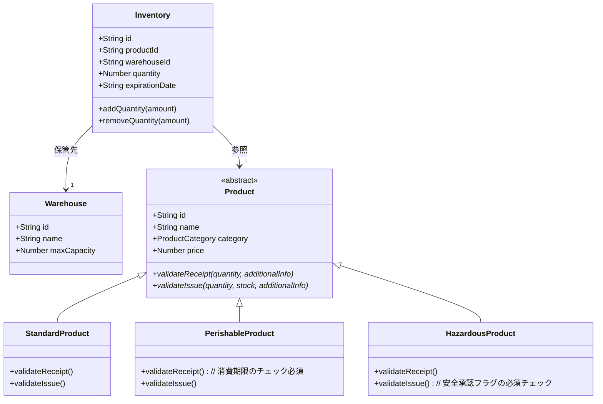
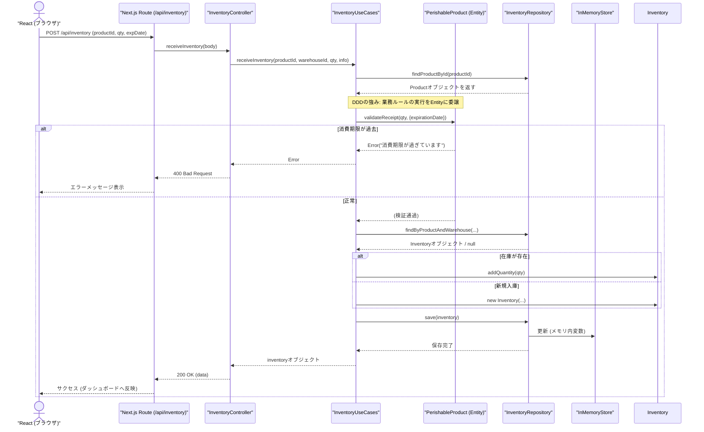

# ABC在庫管理システム 保守仕様書 (Architecture Specification)

本ドキュメントは「ABC在庫管理システム」のアーキテクチャ設計、ドメインモデル、およびシステムの全体構造について説明します。

## 1. システム構成・ディレクトリ構造 (Clean Architecture)

本システムはクリーンアーキテクチャの原則に従い、ドメインロジックを中心に依存の方向が単一（外部から内部へ）となるように設計されています。

```text
src/
├── app/                  # Framework & Driver層 (Next.js App Router / API / UI)
│   ├── api/              # バックエンドエンドポイント (Next.js Route Handlers)
│   ├── layout.tsx        # UI共通レイアウト
│   └── page.tsx          # フロントエンド（ダッシュボード・Reactコンポーネント）
├── lib/                  # 依存性注入 (DI) コンテナの設定
├── adapters/             # Interface Adapter層 (Controller / Repository実装)
│   ├── controllers/      # APIからの入出力をUse Caseへ伝達する
│   └── repositories/     # DB等の永続化実装 (今回はInMemoryDataStore)
├── usecases/             # Use Case層 (アプリケーション固有のビジネスルールの調整とフロー)
└── domain/               # Domain層 (エンティティと業務ルール・リポジトリインターフェース)
    ├── entities/         # Product, Warehouse, Inventory (DDDに基づく中心概念)
    └── repositories/     # 依存逆転のためのインターフェース定義
```

## 2. 各層の依存関係構成図 (Layer Dependency Diagram)

クリーンアーキテクチャにおける各層の依存関係（矢印の方向が依存の方向）を表します。
**「常に外側の層が内側の層に依存する」**というルールを守ることで、内側のドメイン層はフレームワークやデータベースなど外部の技術要素から完全に隔離されます。



## 3. クリーンアーキテクチャ全体クラス図 (Class-Level Dependencies Diagram)

各層の具体的なクラス構造と、クラス間の依存関係・インターフェースを通じた実装関係を表します。



## 4. ユースケース図

以下の図は、システムがユーザーに対して提供する機能（振る舞い）を表します。

```mermaid
usecaseDiagram
    actor User as "ユーザー(担当者)"
    
    package "在庫管理システム" {
        usecase "在庫の検索・一覧表示" as UC1
        usecase "在庫の受入 (入庫)" as UC2
        usecase "在庫の払出 (出庫)" as UC3
        usecase "マスタデータ参照(製品・倉庫)" as UC4
    }

    User --> UC1
    User --> UC2
    User --> UC3
    User --> UC4
```

## 5. ドメインモデル図

ドメイン駆動設計 (DDD) の観点から、システム内で扱う重要な業務概念の静的な関係性を示します。
特に「製品カテゴリ」によるルールの違いをポリモーフィズムによって実現している点が特徴です。



## 6. シーケンス図 (在庫受入フロー)

「フロントエンドから、指定した生鮮食品を受入(入庫)する」際の一連の流れを表します。DDDとクリーンアーキテクチャにおける処理の移譲（UI -> API -> Controller -> UseCase -> Entity -> DB）を可視化しています。


